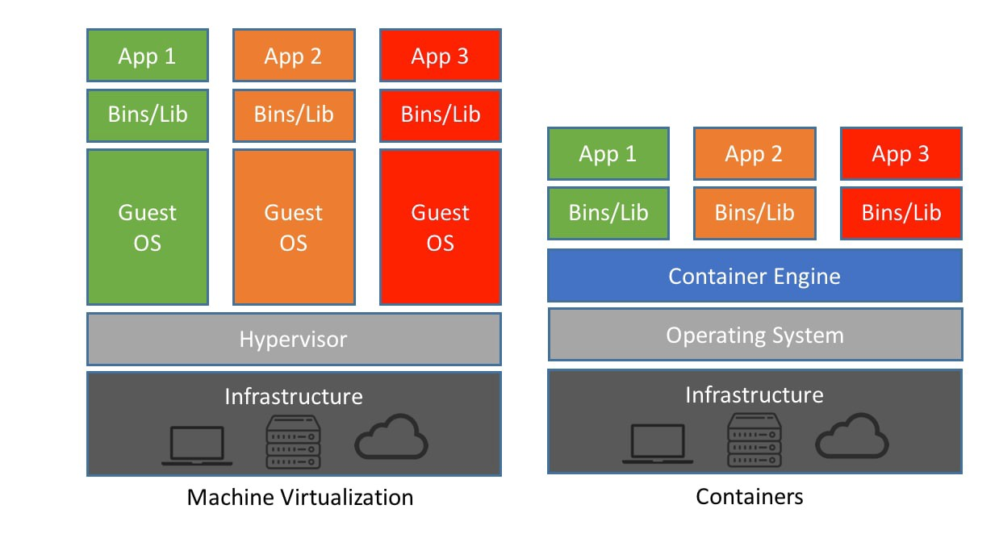

# Openshift & Kubernetes Enablement

## Containers Overview

When attempting to understand containers, it may be helpful to compare them to a Virtual Machine based model. In Figure 1, the left side demonstrates a VM-based model, where a hypervisor exists to virtualize hardware. This allows multiple operating systems to be installed across the same hardware due to the segmentation the hypervisor provides.


_Figure 1_

In the figure, you can see with a VM-based approach, the overhead of the OS is replicated for each isolated workload. Each app has its own host OS that must be configured. Also, consider that the OS consumes a large number of resources of its own, making it expensive to run multiple hosts.

In the container-based approach, we move the responsibility of segmentation away from the hypervisor and to the Operating System directly. This is through the use of Linux kernel capabilities: namespaces and cgroups. The kernel features provide isolation of processes, file system, networking, user management, and resource allocation.

These features allow the deployment of multiple applications on the same host OS without them being able to impact each other. The complete experience to manage these isolation capabilities is known as containerization. In _Figure 1_, you can see each app has its own binaries and libraries that may need to be replicated. But they all run on the same host.

Container tooling provides a simple interface for users to create isolated spaces for their apps/processes to run. Container tooling also provides the ability to save the configuration of containers as ___container images___ for portability and reusability. The images are comprised of blob layers, which inherit from each other.

Pulling an image from a remote registry fetches each blob layer independently, as seen below:

```
$ podman pull docker.io/library/solr
Trying to pull docker.io/library/solr:latest...
Getting image source signatures
Copying blob 223392b822f8 done  
Copying blob a1327346673b done  
Copying blob 0a16ebdf4435 done  
Copying blob 125a6e411906 done  
Copying blob ec461e3e950a done  
Copying blob 32345a8973bc done  
Copying blob b73138edd3c7 done  
Copying blob 273f43aed7c4 done  
Copying blob 4bd9a4e4bc65 done  
Copying config 7452a972a2 done  
Writing manifest to image destination
Storing signatures
7452a972a2d7b98ab52d2696829f2c4222856e9b78d07938cc64c3a26344bd68
```

When working with images, it is typical to use a "base image" that contains common libraries, and "extend" it with our unique application binaries and configuration.

## Container Files Overview
We use Container Files as a mechanism to automate the image building process. Container Files contain a list of commands that our container tooling uses while creating an image. The Containerfile (or Dockerfile) must be stored in the application directory if you are packaging application code and building an image with it. The general structure of a Containerfile is as such, where the Containerfile is created for a sample PHP application:

```

FROM registry.access.redhat.com/ubi8/ubi:8.1

RUN yum --disableplugin=subscription-manager -y module enable php:7.3 \
  && yum --disableplugin=subscription-manager -y install httpd php \
  && yum --disableplugin=subscription-manager clean all

ADD index.php /var/www/html

RUN sed -i 's/Listen 80/Listen 8080/' /etc/httpd/conf/httpd.conf \
  && sed -i 's/listen.acl_users = apache,nginx/listen.acl_users =/' /etc/php-fpm.d/www.conf \
  && mkdir /run/php-fpm \
  && chgrp -R 0 /var/log/httpd /var/run/httpd /run/php-fpm \
  && chmod -R g=u /var/log/httpd /var/run/httpd /run/php-fpm

EXPOSE 8080
USER 1001
CMD php-fpm & httpd -D FOREGROUND


```

The `FROM` instruction specifies the base image for the subsequent instructions, in this case our image is the Red Hat universal base image.

The `RUN` instruction executes commands as part of the build process for our new image. It is reccomended to not have multiple `RUN` instructions and to rather
chain them to minimize the number of layers you bundle with your finished image.

The `ADD`instruction copies new files or directories and adds them to the filesystem of the image which here is specified at /var/www/html. The `ADD`instruction 
differs from the `COPY`instruction in that `ADD` also has the ability to unzip files.

`EXPOSE` is used to inform your container tooling as to what network ports the contianer listens to at runtime. It doesn't publish the port automatically, as you would have to do this with a `-p` in your container tooling to publish and map one or more ports.

`CMD` and `ENTRYPOINT` both define what command gets executed when running a container. There are a set of rules attached to these as per the Docker documentation:

1.Dockerfile should specify at least one of CMD or ENTRYPOINT commands.

2.ENTRYPOINT should be defined when using the container as an executable.

3.CMD should be used as a way of defining default arguments for an ENTRYPOINT command or for executing an ad-hoc command in a container.

4.CMD will be overridden when running the container with alternative arguments.

Once your Container file is written you can execute `podman build -t php-hello .` and `podman run --name hello -p 8080:8080 -d php-hello` and you should see your 
PHP hello world container running! 

## Kubernetes Overview

Container tooling such as Docker or podman makes it easy to run containers on a single host. However, in the enterprise, we need to orchestrate applications at large scale with high availability and other features. This is where Kubernetes comes into play.

Kubernetes allows for the management of container workload lifecycles across a cluster of hosts as well as provide orchestration mechanisms such as networking abstractions, etc. Perhaps the key feature of Kubernetes is its robust API, which provides a consistent model for interaction and also customization capabilities. As you become more familiar with Kubernetes, you will begin to understand the power of its flexible APIs.

The Kubernetes API accepts JSON and YAML formats, which are important to understand in order to be successful.

https://json2yaml.com/ provides an interactive visual for comparing JSON and YAML.

### Compute

Kubernetes provides resources, or `Kinds`, for managing containers and compute.

_Note: You will commonly hear about "resources" or "kinds" when working with Kubernetes. These are interchangeable terms that refer to the type of resource._

#### `Pod`

The smallest manageable compute resource is known as a `Pod`. The following is a simple example of a `Pod` resource:

```yaml
apiVersion: v1
kind: Pod
metadata:
  name: myapp-pod
  labels:
    app: demo
  annotations:
    sample.io/my-annotation: some attribute value
spec:
  containers:
    - name: myapp-container
      image: quay.io/bhouse/busybox:latest
      command: ["sh", "-c", "echo Hello World! && sleep 3600"]
```

In the `Pod` resource, you will notice four top level attributes:

- `apiVersion` - Details about the API, including its version.
- `kind` - The resource type defined in the API.
- `metadata` - Metadata about the resource, including name, labels, and annotations.
- `spec` - The special configuration for the resource. Each resource defines a unique specification with attributes.

Every resource in Kubernetes has a `apiVersion`, `kind`, and `metadata` attribute. _Most_ resources have the `spec` attribute, however, there are exceptions. Eg. `Secrets` and `ConfigMaps`.

In the `metadata`, we can see the `Pod` has a `name`, which needs to be unique per namespace. We will talk about these in a bit. Labels can also be specified for each resource, which are key for resource selection and interations with other resources. Labels exist as a key-value pair and a resource can have any number of labels.

The `spec` is where all the specification exists for the `Pod`. In the simple example, we specify a `containers` attribute which is a list.

##### Health Checks

https://kubernetes.io/docs/tasks/configure-pod-container/configure-liveness-readiness-startup-probes/

#### `ReplicaSet`

#### `Deployment`

### Networking

#### `Service`

#### `Route`

#### `Ingress`

#### `IngressClass`

### Configuration

#### `ConfigMap`

#### `Secret`

### Persistence

#### `PersistentVolume`

#### `PersistentVolumeClaim`

#### `StorageClass`